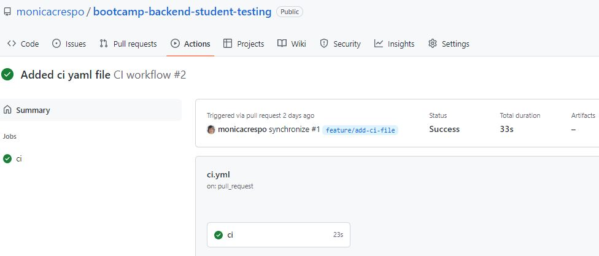
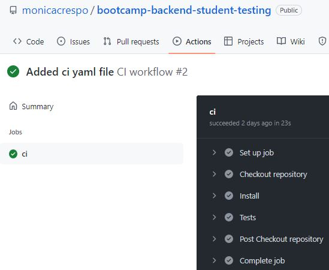

# Introduction

This repository presents Continuous Integration using GitHub Actions following the lesson provided by Bootcamp Backend Lemoncode for the [Module 4 - Rest API - Testing - CI](https://github.com/Lemoncode/bootcamp-backend/tree/ca27da73818fac15986d55afca650a963354b62d/00-stack-documental/04-rest-api/07-testing/07-ci)

# CI pipeline
The aim is to configure a Github action to run all tests in this app.

## Workflow
The following workflow is triggered when activity on a pull request in the workflow's repository occurs. For example, when a pull request is opened or reopened or when the head branch of the pull request is updated.

./.github/workflows/ci.yml

```
name: Ci workflow

on: pull_request

jobs:
  ci:
    runs-on: ubuntu-latest
    steps:
      - name: Checkout repository
        uses: actions/checkout@v3
      - name: Install
        run: npm ci
      - name: Tests
        run: npm test
```

## Workflow visualizer
A screenshot of the workflow visualizer for the above automated continuous integration workflow


A screenshot of the steps of the above automated continuous integration workflow

