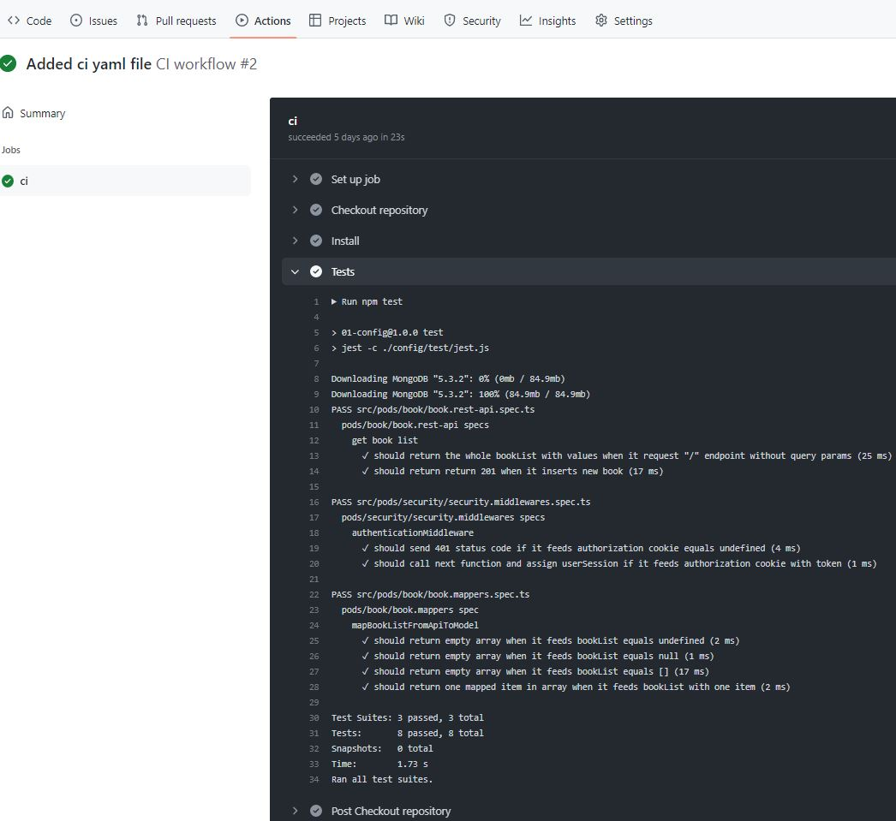

# Introduction

This repository presents Continuous Integration (CI) using GitHub Actions following the lesson provided by Bootcamp Backend Lemoncode for the [Module 4 - Rest API - Testing - CI](https://github.com/Lemoncode/bootcamp-backend/tree/ca27da73818fac15986d55afca650a963354b62d/00-stack-documental/04-rest-api/07-testing/07-ci).
The aim is to configure a Github action to run all tests in this app implemented using node.js.

# CI pipelines - GitHub CI Workflows
Continuous Integration is the process of automating the integration of multiple contributors' code changes into a single software project. It's a key DevOps best practice that enables developers to quickly merge code changes into a central repository from which builds and tests can be executed.

GitHub Actions brings continuous integration (CI) directly to the GitHub flow with templates built by developers for developers. You can also create your own custom CI workflows, and your own continuous deployment (CD) workflows.

GitHub Actions allows you to automate your build, test, and deployment pipeline. You can create workflows that build and test every pull request to your repository, or deploy merged pull requests to production.


## What is workflow in GitHub?
A workflow is a configurable automated process that will run one or more jobs. Workflows are defined by a YAML file checked in to your repository and will run when triggered by an event in your repository, or they can be triggered manually, or at a defined schedule.

For example, you can run a workflow to automatically add the appropriate labels whenever a pull request is opened or reopened or when the head branch of the pull request is updated, in your repository.


## Steps to create this workflow
1. Create a `.github/workflows` directory in your repository on Visual Studio Code.
2. In the .github/workflows directory, create a file named `ci.yml` and add the following YAML contents into the `ci.yml` file:

    ```YAML
    name: Ci workflow

    on: pull_request

    jobs:
      ci:
        runs-on: ubuntu-latest
        steps:
          - name: Checkout repository
            uses: actions/checkout@v3
          - name: Install
            run: npm ci
          - name: Tests
            run: npm test
    ```

3. Commit, push:

    ```
    git add .
    git commit -m "added yaml"
    git push -u origin feature/add-ci-file
    ```

    Note that if the `feature/add-ci-file` branch is already on Github, it would only be needed `git push`.

4. Create a pull request on GitHub
    1. Switch to the `feature/add-ci-file` branch that you want to create a pull request for. 
    2. Confirm that `master` is the base branch where you want to merge your changes. 
    3. Click Create Pull Request (PR). 

    Creating the PR triggers the `pull_request` event and runs this workflow.

## Viewing your workflow results
1. On GitHub.com, navigate to the main page of the repository.
2. Under your repository name, click  Actions.
3. In the left sidebar, click the workflow you want to see `CI workflow`.
  
4. From the list of workflow runs, click the name of the run you want to see `Added ci yaml file`.
5. Under Jobs , click the `ci` job.
  
6. The log shows you how each of the steps was processed. Expand any of the steps to view its details.
  
